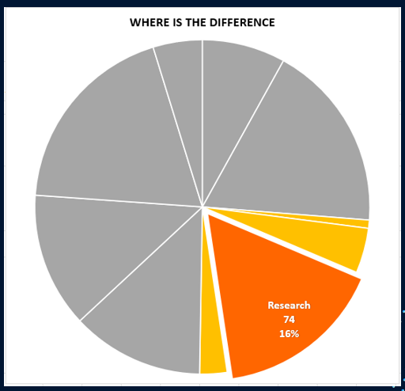
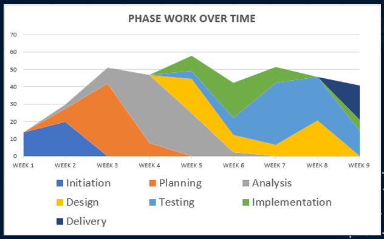

# PostProjectAnalysis

<header>
  <h1  align="left">Project Analysis Dashboard Visualization</h1>

  

    This Repository contains useful dashboard visualizations made with data taken from Microsoft Project over the lifespan of a 10 week Agile Project. In the dynamic landscape of project management, the ability to distill complex information into clear and meaningful visuals is paramount. These visualizations serve as powerful tools for understanding, analyzing, and communicating the intricacies of project timelines and resource allocation.

	
  

</header>

<!-- table of contents-->
<nav>
      

      

	    <a href="#micproject">Microsoft Project Scheduled Hours Estimates</a> •
         <a href="#estimates">Hourly Budget Estimates</a> •
            <a href="#actuals">Hourly Actuals</a> •
            <a href="#keydiff">Key Differences</a> 
 
          <a href="#timeline">Hourly Actual Timeline</a> •
         <a href="#keyfeatures">Key Requirments</a> •
	 <a href="#summary">Project Analysis Summary</a>
      

</nav>

<section id="micproject">
<h1>Microsoft Project Work Scheduled Hours Estimates</h1>

The Microsoft Project document provides a comprehensive and visually organized schedule for a project, offering a detailed roadmap of tasks, milestones, and timelines. Utilizing Gantt charts and other project management tools, this document presents a clear overview of project activities, their interdependencies, and the anticipated project timeline. It serves as a dynamic and interactive resource, allowing project stakeholders to monitor progress, identify critical paths, and make informed decisions to ensure successful project completion. The document may include task durations, resource allocation, and dependencies, facilitating effective project coordination and communication among team members. Overall, the Microsoft Project document is an invaluable tool for project managers and teams to plan, track, and manage project schedules efficiently.
	 	 
	<u><b>HOWEVER </b> </u>This sort of data is hard to digest as a simple dataset and can benefit greatly from having a dashboard built which visualizes many of the key features of this data.

 

</section>

<section id="estimates">
<h1>Hourly Budget Estimates</h1>

	The pie chart illustrates the estimated hourly budget distribution before milestone completion, offering a visually intuitive representation of resource allocation. Each segment of the pie corresponds to a specific category or task, showcasing the proportional distribution of hours dedicated to different project components. The chart effectively communicates the budget priorities, highlighting areas where more hours are allocated and emphasizing the relative importance of each task in the overall project. This visual aid assists project managers and stakeholders in quickly grasping the resource allocation landscape, enabling them to make informed decisions and adjustments to ensure the project stays on track and within the anticipated budget constraints.

 

</section>

<section id="actuals">
<h1>Hours Usage Actual</h1>

The adjusted pie chart provides a post-project overview, depicting the actual allocation of hours across different categories after milestone completion. Each slice of the pie reflects the real-time distribution of hours spent on various tasks, revealing any deviations from the initial estimates. This visual representation enables a direct comparison between the estimated and actual hours, offering insights into the project's execution efficiency. Managers and stakeholders can easily identify areas where resource usage aligned with projections and pinpoint any significant variances. The adjusted pie chart serves as a valuable tool for retrospective analysis, aiding in lessons learned and informing future project planning by capturing the actual effort expended in completing each aspect of the project.

 

</section>

<section id="keydiff">
<h1>Key Budget v Actual Major Discrepency</h1>

The comparative pie chart effectively pinpoints the areas of greatest variance between estimated and actual hours for a completed project. Each segment of the pie represents a specific task or category, and the chart color-codes the disparities between the initial estimates and the final actual hours. The slices with the most substantial differences are visually emphasized, drawing attention to key areas where the project deviated significantly from the initial projections. This graphical representation allows project managers and stakeholders to quickly identify and focus on the critical aspects that contributed to the largest gaps between estimated and actual hours. Such insights are invaluable for post-project analysis, facilitating a targeted understanding of where adjustments or improvements may be necessary in future project planning and resource allocation.

 

</section>
	
<section id="timeline">
<h1>Actual Hourly Usage Over Project Timeline </h1>

The timeline chart provides a comprehensive visual representation of the weekly hour expenses categorized by project areas over the duration of the project. Each category is represented by a distinct color or segment on the timeline, and the chart illustrates the total time spent on each project area on a week-by-week basis. This dynamic visual display allows stakeholders to easily track the evolution of time allocation throughout the project's timeline, highlighting peaks and troughs in resource utilization for each category. The timeline chart serves as a powerful tool for analyzing trends, identifying critical periods of high or low activity, and assessing the overall distribution of effort across different project areas. This information aids project managers and teams in making informed decisions, optimizing resource allocation, and ensuring a balanced and efficient workflow throughout the project's lifecycle.

 

</section>

<section id="keyfeatures">

  <article>
</section>    <h1>Key Requirements</h1>

      
- [x] Accurately Estimate and Record Hours Budget and Actual Spent Hours
- [x] Identify major deviations from schedule
- [x] Identify areas of interest
- [x] Visualize Hourly time usage across project timeline.

  </article>
   
</section>

<section id="summary">
<h1>Project Analysis Summary</h1>

The analysis facilitated by the charts and graphs described above offers several key benefits for effective project management:
 

<ol>
<li>
	Visual Clarity: The charts provide a visually intuitive representation of complex data, making it easier for stakeholders to grasp and interpret information related to project timelines, resource allocation, and variances.
</li>
<li>
    Comparative Insights: By presenting estimated versus actual hours or showcasing variances, the charts enable a direct comparison, allowing stakeholders to quickly identify areas of alignment or discrepancy. This supports a more nuanced understanding of project performance.
</li>
<li>
    Trend Identification: The timeline chart helps in identifying trends in weekly hour expenses over the project's duration. This facilitates the recognition of patterns, allowing project managers to pinpoint critical periods of resource-intensive activities or potential efficiency improvements.
</li>

<li>
	Resource Optimization: The charts assist in optimizing resource allocation by highlighting areas with the largest differences between estimated and actual hours. This insight enables teams to make informed decisions for better resource management in future projects.
</li>
    Decision Support: The visual representation of data aids decision-making by providing a comprehensive overview of project dynamics. Stakeholders can quickly identify areas of concern or success, allowing for timely adjustments and informed strategic decisions.
<li>Post-Project Analysis: The comparative and timeline charts serve as valuable tools for post-project analysis, helping teams understand what worked well and areas where improvements can be made. This knowledge is crucial for continuous improvement in project management practices.</li>
    
<li> Communication: The visual nature of the charts enhances communication among project teams and stakeholders. Complex data is presented in an accessible format, fostering a shared understanding of project progress, challenges, and successes.
</li>
<li>  Lessons Learned: The analysis derived from the charts contributes to lessons learned, informing future project planning by capturing real-world insights into resource utilization and the accuracy of initial estimates.
</li>
</ol>
 
In summary, the charts and graphs discussed offer a comprehensive and accessible means of analyzing project data, empowering teams and stakeholders to make informed decisions, optimize resources, and enhance overall project management efficiency.

 

</section>

